**My-Productivity-Tracker**

Minimalist Java desktop app to track student productivity throughout the day, manage his/her time table/grades, maintain notes, etc. using simple t stats to help you be more aware of the time you're doing what you should be doing, generating an activity map for the whole year, maintaining a To-do list, list his/her expected grades.. Java Swing GUI.

**App Use Instance SnapShot:**

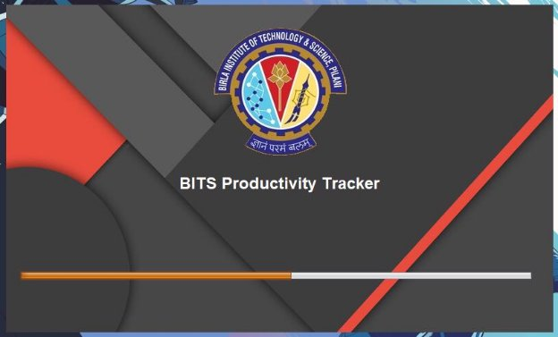

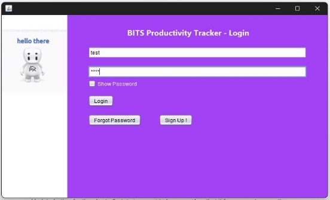

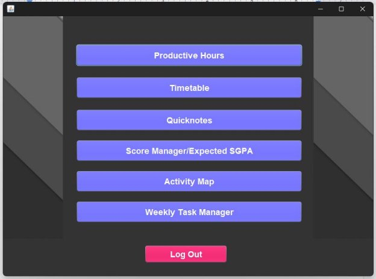

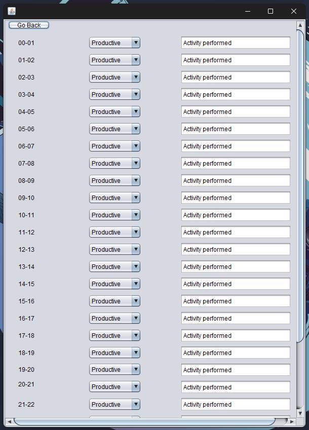

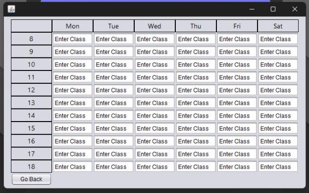

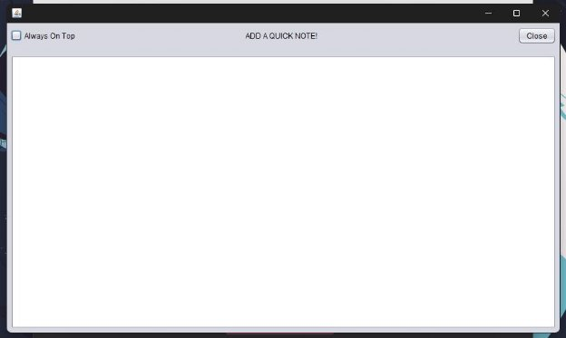

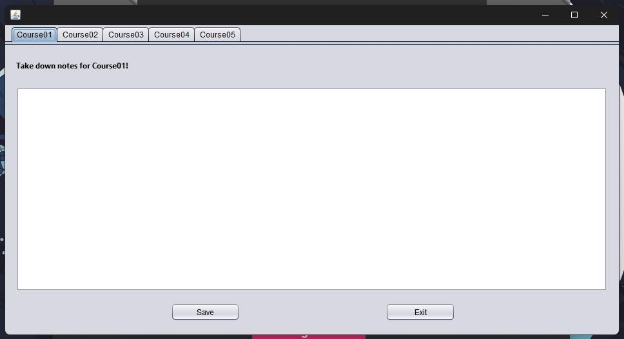

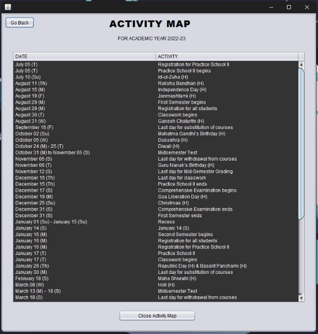

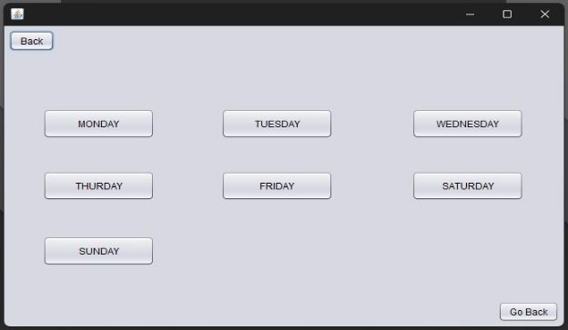

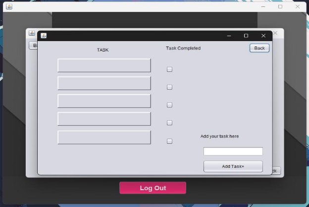

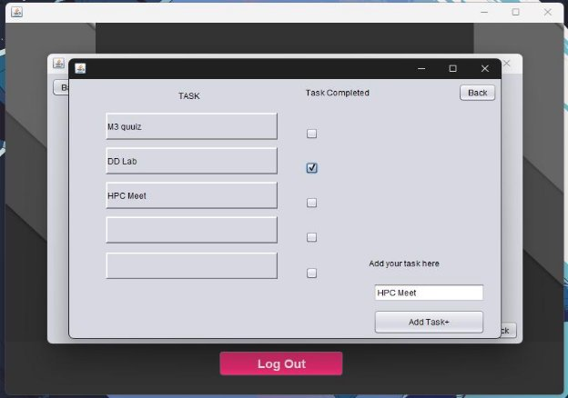

**Main Features:**

- **Login Page :** The user can login into the application by entering his username and password.
- If the user does not have previously created credentials, he/she can make new one’s using the Sign Up button.
- The default **username : test** and **password : test** can also be used to log into the application.
- **Menu Screen :** After logging in, the user is greeted with a menu screen where he/she can select the operation he/she wants to perform.
- **Productivity Hours :** The Productive hours button opens up a new window where the user can input his/her activities’ productive state and then generate an hours based record for the whole day.
- **TimeTable** : Next up on the menu bar is the Time table button which helps the user create a systematic time table for themselves.
- **Note Taking :** Then comes the Note taking functionality. Here the user has 2 options, he can either create a random single note or create notes for various different courses specifically. The notes a user creates will be saved automatically or by clicking the Save button and will be available the next time he/she accesses the page.
- **Score Manager :** The Score Manager functionality helps users generate their SGPA/CGPA based on their expected grades and the previous years grades/marks.
- **Activity Map :** The Activity Map button presents the user with an academic calendar for the particular year.
- **Weekly Task Manager :** Clicking on this option provides the user with an option to create a To-Do list for each day and check out the tasks he/she has already performed.

**Tools Used:**

**Java Swing Java 8.0 NetBeans 8.2 Windows 11**

**How to run:**

- A .jar executable file has been placed in 50\_2422\_0001\_1776\_0336/productivityTracker/ which can be run by simply double clicking.
- Make use of Go Back buttons and not directly close else the whole app closes itself.
- By default all the hours have been set to Productive in Productivity Tracker.
